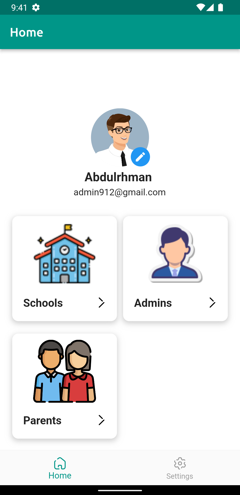
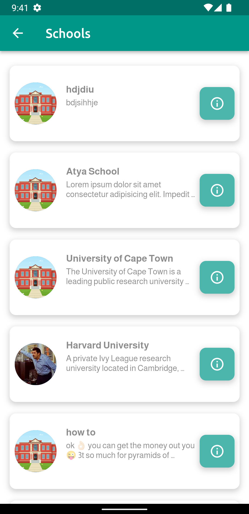
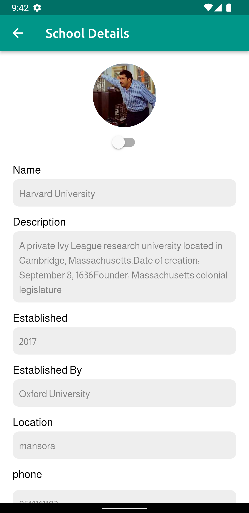
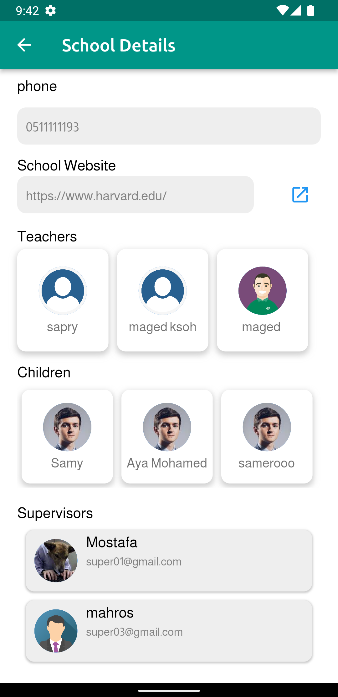

# Monitoring

Monitoring is an integrated system that allows school principals to supervise teachers, students, and activities in the school. Parents can also register in the application, see their children's data, and register their children in available schools and activities. The application also includes supervisors who manage schools and perform other tasks.

## Screenshots

Here are some screenshots of the Monitoring app:

## Screenshots

Here are some screenshots of the Monitoring app:

### Admin Panel:
| Home Page | Schools page | School Details | | Home Page | Schools page | School Details | Movies Page By Genres |
 |
| ----------- | ----------- | ----------- | ----------- |
|||||

## Table of Contents

The following table outlines the different sections of this README file:

- [Technologies Used](#technologies-used)
- [Packages Used](#packages-used)
- [Project Interface](#project-interface)
- [Contribution](#contribution)

## Technologies Used

- **Flutter**: Flutter is an open-source UI toolkit for building high-performance, high-fidelity, apps for iOS, Android, and the web from a single codebase. 
  - [Flutter Official Website](https://flutter.dev/)
  - [Flutter Documentation](https://flutter.dev/docs)
- **Firebase**: Firebase is a cloud-based platform for building mobile and web applications. In this project, Firebase is used to store data for the application.
  - [Firebase Official Website](https://firebase.google.com/)
  - [Firebase Documentation](https://firebase.google.com/docs)
- **Firebase Cloud Messaging**: Firebase Cloud Messaging (FCM) is a cross-platform messaging solution that lets you reliably deliver messages at no cost.
  - [Firebase Cloud Messaging Official Website](https://firebase.google.com/products/cloud-messaging)
  - [Firebase Cloud Messaging Documentation](https://firebase.google.com/docs/cloud-messaging)
- **BLoC**: BLoC (Business Logic Component) is a state management pattern for managing application state. In this project, BLoC is used to manage the application state effectively.
  - [BLoC Official Website](https://bloclibrary.dev/)
  - [BLoC Documentation](https://bloclibrary.dev/#/)

## Packages Used

The following packages are used in this project:

| Package Name | Package Version | Package Description |
| --- | --- | --- |
| shared_preferences | ^2.1.0 | Provides a way to store and retrieve user preferences in Flutter. |
| block | ^8.1.1 | A lightweight library for building scalable Flutter applications using the BLoC pattern. |
| flutter_block | ^8.1.2 | A Flutter library that provides a set of widgets and classes for implementing the BLoC pattern. |
| firebase_auth | ^4.4.0 | Provides Firebase authentication services. |
| firebase_core | ^2.9.0 | Provides a core set of functionality for Firebase. |
| cloud_firestore | ^4.5.0 | Provides a way to store and retrieve data from the Cloud Firestore. |
| google_fonts | ^4.0.3 | Provides a set of beautiful and free Google fonts for use in Flutter apps. |
| image_picker | ^0.8.7+1 | Provides a way to pick images from the device gallery or camera in Flutter. |
| firebase_storage | ^11.1.0 | Provides a way to store and retrieve files from Firebase Cloud Storage. |
| fluttertoast | ^8.2.1 | Provides a way to display toast messages in Flutter apps. |
| animal_do | ^3.0.2 | Provides a set of beautiful and customizable animations for use in Flutter apps. |
| intl | ^0.17.0 | Provides internationalization and localization support for Flutter apps. |
| url_launcher | ^6.1.10 | Provides a way to launch URLs in the device's default browser in Flutter. |
| file_picker | ^5.2.9 |
| firebase_messaging | ^11.1.0 | Provides a way to send and receive messages between the app and the Firebase Cloud Messaging service. |
| flutter_local_notifications | ^9.1.0 | Provides a way to display local notifications in Flutter apps. |
|http | ^0.13.4 | Provides a way to perform HTTP requests in Flutter apps. |
## Contribution

Contributions to the project are welcome! If you'd like to contribute, please fork the repository and make changes as you'd like. Pull requests are warmly welcome.

---
